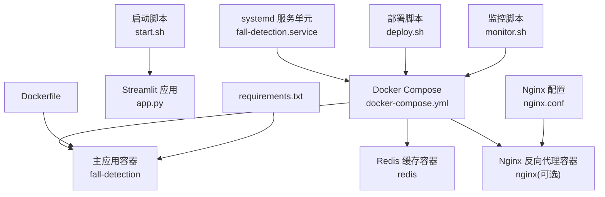
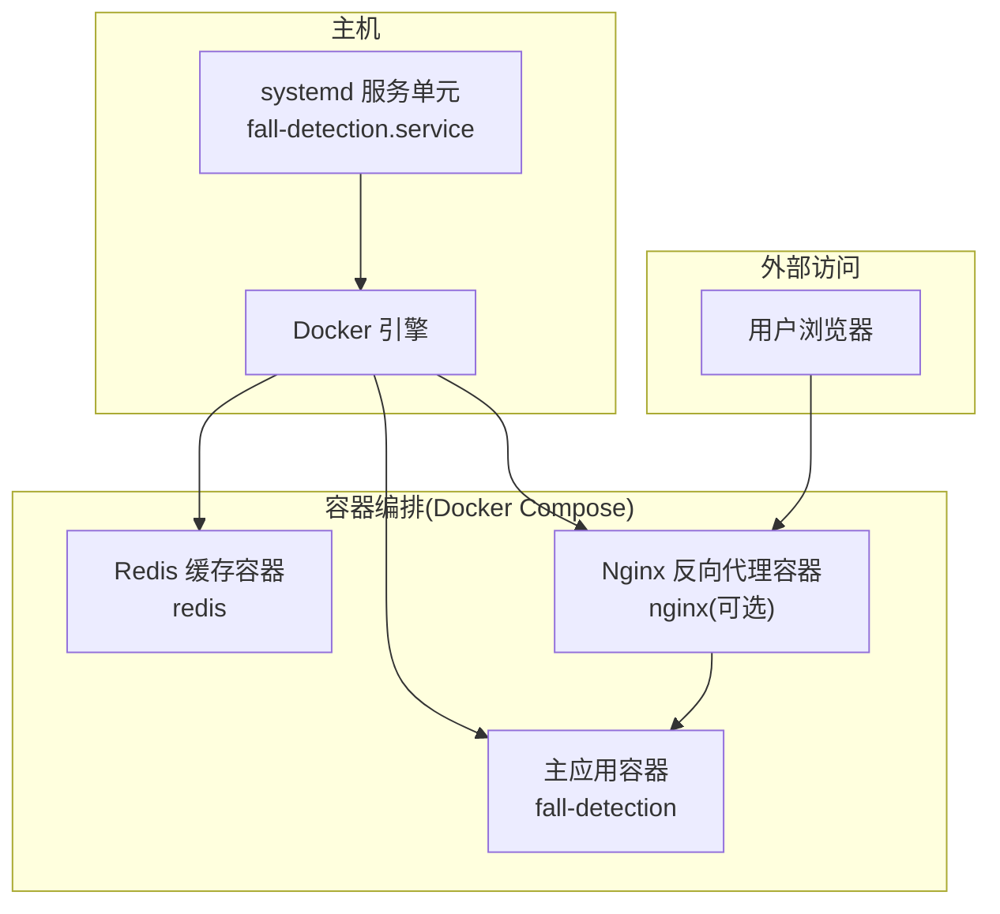
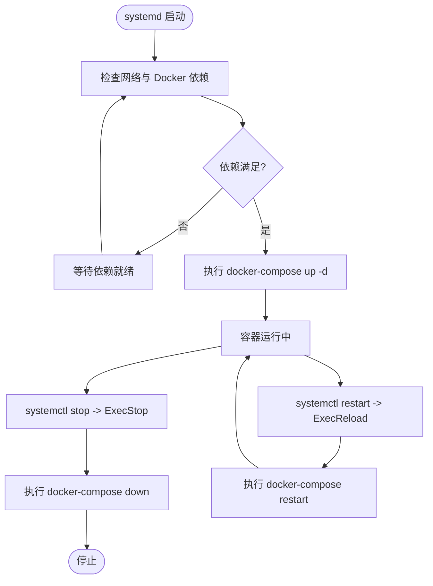
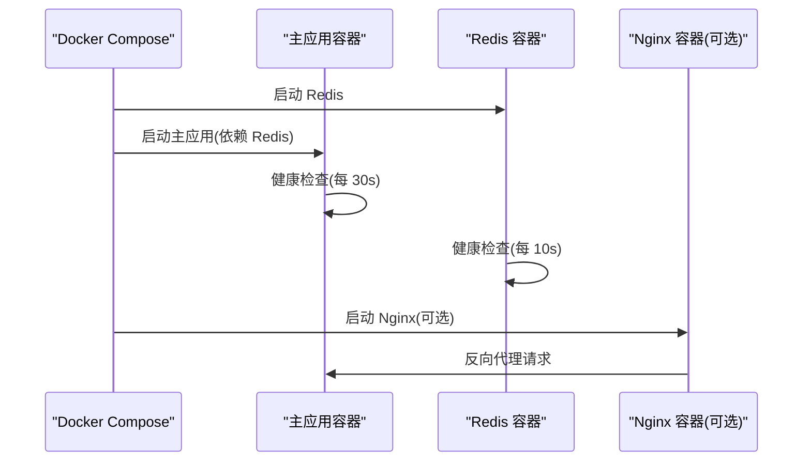
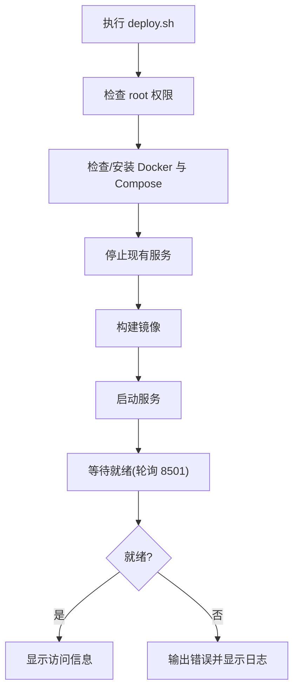
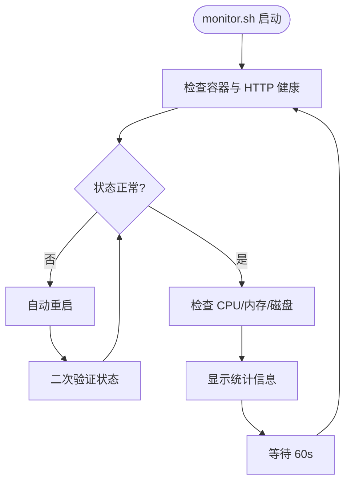
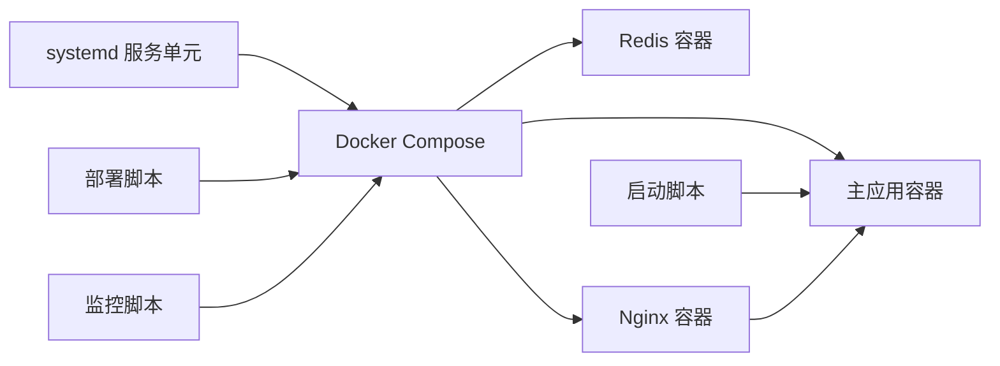

# 系统管理

<cite>
**本文引用的文件**
- [fall-detection.service](file://fall-detection.service)
- [docker-compose.yml](file://docker-compose.yml)
- [Dockerfile](file://Dockerfile)
- [deploy.sh](file://deploy.sh)
- [monitor.sh](file://monitor.sh)
- [start.sh](file://start.sh)
- [nginx.conf](file://nginx.conf)
- [requirements.txt](file://requirements.txt)
- [app.py](file://app.py)
- [demos/fall_detection_demo.py](file://demos/fall_detection_demo.py)
</cite>

## 目录
1. [简介](#简介)
2. [项目结构](#项目结构)
3. [核心组件](#核心组件)
4. [架构总览](#架构总览)
5. [详细组件分析](#详细组件分析)
6. [依赖关系分析](#依赖关系分析)
7. [性能考虑](#性能考虑)
8. [故障排查指南](#故障排查指南)
9. [结论](#结论)
10. [附录](#附录)

## 简介
本文件面向系统管理员与运维工程师，提供 GuardianFall（摔倒检测系统）的系统管理文档。内容覆盖 systemd 服务配置、启动脚本与监控脚本的实现、服务单元文件的配置项与自动启动策略、进程管理与健康检查、服务状态监控、日志轮转与资源使用管理、服务重启策略与故障恢复机制、权限与用户管理、以及服务依赖关系处理等。文档同时给出架构图、流程图与最佳实践建议，帮助读者在生产环境中稳定、高效地运行该系统。

## 项目结构
GuardianFall 的系统管理涉及以下关键文件：
- systemd 服务单元：定义服务启动、停止、重启与超时策略
- Docker Compose：编排主应用、Redis 缓存与可选 Nginx 反向代理
- Dockerfile：容器镜像构建与健康检查
- 部署脚本：一键部署、更新、启动、停止、日志查看与资源清理
- 监控脚本：服务状态检查、资源使用监控、持续监控循环与自动重启
- 启动脚本：交互式一键启动，支持多种运行模式
- Nginx 配置：生产环境反向代理与安全加固
- 依赖清单：Python 包依赖
- 应用入口：Streamlit Web 界面与 Demo

**图表来源**
- [fall-detection.service:1-28](file://fall-detection.service#L1-L28)
- [docker-compose.yml:1-149](file://docker-compose.yml#L1-L149)
- [Dockerfile:1-50](file://Dockerfile#L1-L50)
- [deploy.sh:1-243](file://deploy.sh#L1-L243)
- [monitor.sh:1-183](file://monitor.sh#L1-L183)
- [start.sh:1-109](file://start.sh#L1-L109)
- [nginx.conf:1-127](file://nginx.conf#L1-L127)
- [requirements.txt:1-34](file://requirements.txt#L1-L34)
- [app.py:1-662](file://app.py#L1-L662)

**章节来源**
- [fall-detection.service:1-28](file://fall-detection.service#L1-L28)
- [docker-compose.yml:1-149](file://docker-compose.yml#L1-L149)
- [Dockerfile:1-50](file://Dockerfile#L1-L50)
- [deploy.sh:1-243](file://deploy.sh#L1-L243)
- [monitor.sh:1-183](file://monitor.sh#L1-L183)
- [start.sh:1-109](file://start.sh#L1-L109)
- [nginx.conf:1-127](file://nginx.conf#L1-L127)
- [requirements.txt:1-34](file://requirements.txt#L1-L34)
- [app.py:1-662](file://app.py#L1-L662)

## 核心组件
- systemd 服务单元：通过 oneshot 类型在启动时执行 docker-compose up -d，并在停止/重启时分别执行 down 与 restart；设置启动/停止超时，确保容器生命周期受控。
- Docker Compose：定义主应用、Redis 缓存与可选 Nginx；配置端口映射、环境变量、数据卷、资源限制、健康检查与日志驱动。
- Dockerfile：基于 Python slim 镜像，安装系统依赖与 Python 依赖，暴露端口并配置健康检查。
- 部署脚本：封装 Docker 安装、镜像构建、服务启动、状态检查、访问信息展示、更新与清理等流程。
- 监控脚本：检查容器与 HTTP 健康状态、资源使用率、查看日志、显示统计信息、自动重启与持续监控循环。
- 启动脚本：交互式引导，检查 Python 环境、创建/激活虚拟环境、安装依赖、选择运行模式（Web、Demo、实时检测、录制）。
- Nginx 配置：生产级反向代理，含安全头、TLS、WebSocket 支持、健康检查端点与静态资源缓存。
- 依赖清单：集中声明 Python 包版本范围，确保可重复构建。
- 应用入口：Streamlit Web 界面与 Demo 脚本，支持模拟数据与真实相机（Azure Kinect）两种模式。

**章节来源**
- [fall-detection.service:1-28](file://fall-detection.service#L1-L28)
- [docker-compose.yml:1-149](file://docker-compose.yml#L1-L149)
- [Dockerfile:1-50](file://Dockerfile#L1-L50)
- [deploy.sh:1-243](file://deploy.sh#L1-L243)
- [monitor.sh:1-183](file://monitor.sh#L1-L183)
- [start.sh:1-109](file://start.sh#L1-L109)
- [nginx.conf:1-127](file://nginx.conf#L1-L127)
- [requirements.txt:1-34](file://requirements.txt#L1-L34)
- [app.py:1-662](file://app.py#L1-L662)

## 架构总览
GuardianFall 的系统管理采用“systemd + Docker Compose”的组合方案：
- systemd 负责服务生命周期与自动启动
- Docker Compose 负责多容器编排与依赖管理
- 主应用容器承载 Streamlit Web 界面
- Redis 缓存用于会话与状态存储
- Nginx 可选作为反向代理与安全边界

**图表来源**
- [fall-detection.service:1-28](file://fall-detection.service#L1-L28)
- [docker-compose.yml:1-149](file://docker-compose.yml#L1-L149)
- [nginx.conf:1-127](file://nginx.conf#L1-L127)

## 详细组件分析

### systemd 服务单元配置与自动启动策略
- 单元类型：oneshot，启动后保持退出状态，由 ExecStart/ExecStop/ExecReload 控制容器生命周期
- 依赖关系：After/Wants/Requires 确保网络与 Docker 服务可用后再启动
- 工作目录：指定到项目根目录，保证 docker-compose 命令在正确路径执行
- 超时设置：启动超时与停止超时，避免长时间阻塞
- 安装目标：multi-user.target，随系统启动自动启用

**图表来源**
- [fall-detection.service:1-28](file://fall-detection.service#L1-L28)

**章节来源**
- [fall-detection.service:1-28](file://fall-detection.service#L1-L28)

### Docker Compose 编排与健康检查
- 服务定义：主应用、Redis 缓存、可选 Nginx
- 端口映射：主应用 8501
- 环境变量：Streamlit 服务器参数、日志级别与检测阈值
- 数据卷：应用代码（开发模式）、持久化数据目录
- 资源限制：CPU 与内存上限与预留
- 健康检查：主应用与 Redis 的健康检查策略
- 日志驱动：json-file，限制单文件大小与保留数量
- 网络：自定义桥接网络，隔离服务间通信
- 依赖：主应用依赖 Redis

**图表来源**
- [docker-compose.yml:1-149](file://docker-compose.yml#L1-L149)

**章节来源**
- [docker-compose.yml:1-149](file://docker-compose.yml#L1-L149)

### Dockerfile 构建与健康检查
- 基础镜像：Python 3.10 slim
- 系统依赖：图形与媒体相关库
- 环境变量：禁用字节码写入、流式输出、Streamlit 服务器参数
- 健康检查：对 Streamlit 内部健康端点进行探测
- CMD：启动 Streamlit 应用

**章节来源**
- [Dockerfile:1-50](file://Dockerfile#L1-L50)

### 部署脚本（一键部署、更新、清理）
- 权限检查：要求 root 权限
- Docker 安装：自动安装 Docker 与 Docker Compose
- 停止服务：停止现有容器与相关进程
- 构建镜像：强制重建，避免缓存影响
- 启动服务：后台启动并等待就绪
- 状态检查：轮询 HTTP 端口，超时则输出日志
- 访问信息：本地与远程访问地址
- 子命令：update、start、stop、logs、status、cleanup、help

**图表来源**
- [deploy.sh:1-243](file://deploy.sh#L1-L243)

**章节来源**
- [deploy.sh:1-243](file://deploy.sh#L1-L243)

### 监控脚本（状态检查、资源监控、自动重启与持续监控）
- 状态检查：检查容器是否运行、HTTP 服务是否返回 200
- 资源监控：CPU、内存、磁盘使用率阈值判断
- 日志查看：实时查看容器日志
- 统计信息：容器启动时间、重启次数、网络与进程信息
- 自动重启：失败时触发 docker-compose restart 并二次验证
- 持续监控：定时循环检查，支持 Ctrl+C 中断

**图表来源**
- [monitor.sh:1-183](file://monitor.sh#L1-L183)

**章节来源**
- [monitor.sh:1-183](file://monitor.sh#L1-L183)

### 启动脚本（交互式一键启动）
- Python 环境检查与虚拟环境创建/激活
- 依赖安装（requirements.txt）
- 运行模式选择：Web 界面、命令行 Demo、实时检测、数据录制
- 交互式参数输入（录制时长、输出目录）

**章节来源**
- [start.sh:1-109](file://start.sh#L1-L109)

### Nginx 反向代理配置
- 基础配置：Gzip、日志格式、keepalive
- HTTP 到 HTTPS 重定向与 Let’s Encrypt 验证
- HTTPS 安全配置：TLS 版本、加密套件、安全头
- WebSocket 支持：Streamlit 必需
- 健康检查端点：/health
- 静态资源缓存：长期缓存策略

**章节来源**
- [nginx.conf:1-127](file://nginx.conf#L1-L127)

### 应用入口与 Demo
- Streamlit Web 界面：实时点云可视化、检测结果展示、报警历史与配置管理
- Demo 脚本：模拟数据、真实相机（Azure Kinect）与数据录制模式

**章节来源**
- [app.py:1-662](file://app.py#L1-L662)
- [demos/fall_detection_demo.py:1-373](file://demos/fall_detection_demo.py#L1-L373)

## 依赖关系分析
- systemd 依赖 Docker 与网络服务
- 主应用依赖 Redis 缓存
- Nginx 依赖主应用容器
- 部署脚本依赖 Docker 与 curl
- 监控脚本依赖 docker-compose、curl、bc、top、free、df、netstat、ps
- 启动脚本依赖 Python3、venv、pip、streamlit、OpenCV、Open3D 等

**图表来源**
- [fall-detection.service:1-28](file://fall-detection.service#L1-L28)
- [docker-compose.yml:1-149](file://docker-compose.yml#L1-L149)
- [deploy.sh:1-243](file://deploy.sh#L1-L243)
- [monitor.sh:1-183](file://monitor.sh#L1-L183)
- [start.sh:1-109](file://start.sh#L1-L109)
- [nginx.conf:1-127](file://nginx.conf#L1-L127)

**章节来源**
- [fall-detection.service:1-28](file://fall-detection.service#L1-L28)
- [docker-compose.yml:1-149](file://docker-compose.yml#L1-L149)
- [deploy.sh:1-243](file://deploy.sh#L1-L243)
- [monitor.sh:1-183](file://monitor.sh#L1-L183)
- [start.sh:1-109](file://start.sh#L1-L109)
- [nginx.conf:1-127](file://nginx.conf#L1-L127)

## 性能考虑
- 资源限制：主应用容器设置 CPU 与内存上限与预留，避免资源争抢
- 健康检查：合理的间隔与超时，减少误判与资源浪费
- 日志轮转：json-file 驱动配合大小与文件数限制，防止磁盘膨胀
- 网络与代理：Nginx 启用 Gzip 与静态资源缓存，提升前端性能
- 进程管理：systemd oneshot + docker-compose，确保容器生命周期可控
- 依赖优化：requirements.txt 明确版本范围，避免兼容性问题

[本节为通用性能建议，不直接分析具体文件]

## 故障排查指南
- 服务状态异常
  - 使用部署脚本查看状态与日志：docker-compose ps、logs
  - 使用监控脚本 status、logs、stats、restart
- 启动失败
  - 检查 Docker 与 Compose 是否安装并运行
  - 查看健康检查失败原因与容器日志
- 端口冲突
  - 确认 8501、80、443 端口未被占用
- 权限问题
  - 部署脚本与 systemd 服务需 root 权限
- 资源不足
  - 检查 CPU、内存、磁盘使用率，必要时调整资源限制
- Nginx 代理问题
  - 检查证书路径、安全头与 WebSocket 升级头配置

**章节来源**
- [deploy.sh:1-243](file://deploy.sh#L1-L243)
- [monitor.sh:1-183](file://monitor.sh#L1-L183)
- [nginx.conf:1-127](file://nginx.conf#L1-L127)

## 结论
GuardianFall 的系统管理通过 systemd 与 Docker Compose 的协同，实现了服务的自动化启动、健康检查、资源限制与日志轮转。部署脚本与监控脚本提供了完整的运维工具链，Nginx 配置增强了生产环境的安全性与稳定性。结合合理的重启策略与故障恢复机制，系统可在生产环境中可靠运行。

[本节为总结性内容，不直接分析具体文件]

## 附录

### systemd 服务单元关键字段说明
- Unit
  - Description：服务描述
  - After/Wants/Requires：依赖关系与启动顺序
- Service
  - Type：oneshot
  - RemainAfterExit：保持退出状态
  - WorkingDirectory：工作目录
  - ExecStart/ExecStop/ExecReload：启动/停止/重启命令
  - TimeoutStartSec/TimeoutStopSec：超时设置
- Install
  - WantedBy：安装目标

**章节来源**
- [fall-detection.service:1-28](file://fall-detection.service#L1-L28)

### Docker Compose 关键配置说明
- services
  - build：镜像构建上下文与 Dockerfile
  - container_name：容器名称
  - restart：重启策略
  - ports：端口映射
  - environment：环境变量
  - volumes：数据卷挂载
  - deploy.resources.limits/reservations：资源限制
  - healthcheck：健康检查
  - logging：日志驱动与轮转
  - networks.depends_on：服务依赖
- volumes/networks：数据卷与网络定义

**章节来源**
- [docker-compose.yml:1-149](file://docker-compose.yml#L1-L149)

### 部署脚本命令参考
- deploy：完整部署
- update：更新部署
- start/stop：仅启动/停止
- logs：查看日志
- status：查看状态
- cleanup：清理资源
- help：显示帮助

**章节来源**
- [deploy.sh:1-243](file://deploy.sh#L1-L243)

### 监控脚本命令参考
- status：检查服务状态与资源
- logs：查看日志
- stats：显示统计信息
- monitor：持续监控
- restart：自动重启
- help：显示帮助

**章节来源**
- [monitor.sh:1-183](file://monitor.sh#L1-L183)

### 启动脚本运行模式
- Web 界面：Streamlit
- 命令行 Demo：模拟数据
- 实时检测：Azure Kinect
- 数据录制：指定时长与输出目录

**章节来源**
- [start.sh:1-109](file://start.sh#L1-L109)
- [demos/fall_detection_demo.py:1-373](file://demos/fall_detection_demo.py#L1-L373)

### Nginx 生产配置要点
- TLS 与安全头
- WebSocket 支持
- 健康检查端点
- 静态资源缓存

**章节来源**
- [nginx.conf:1-127](file://nginx.conf#L1-L127)