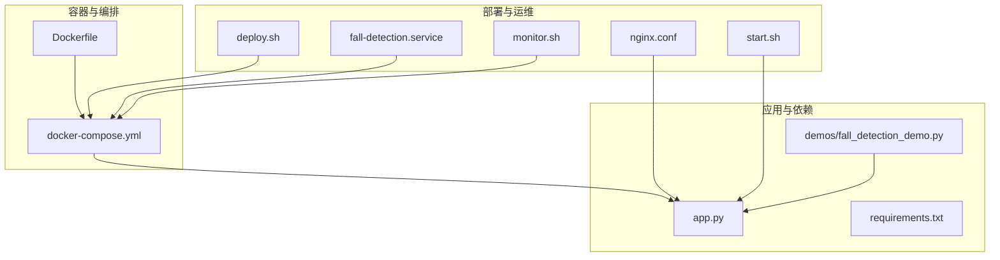
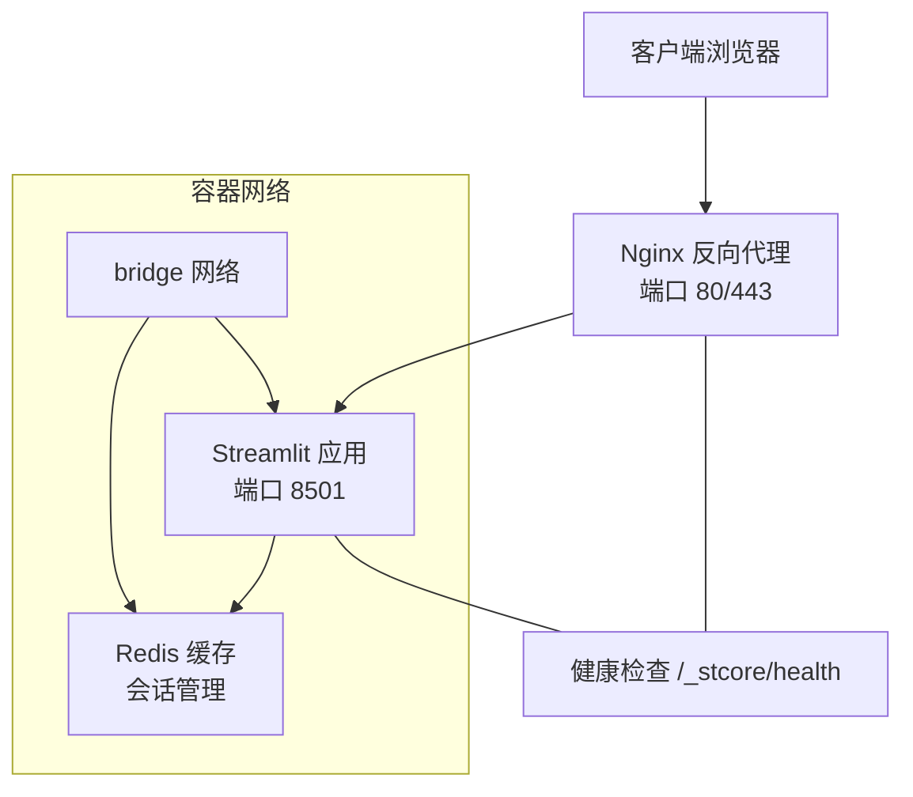
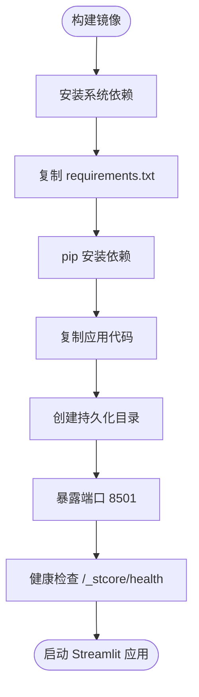
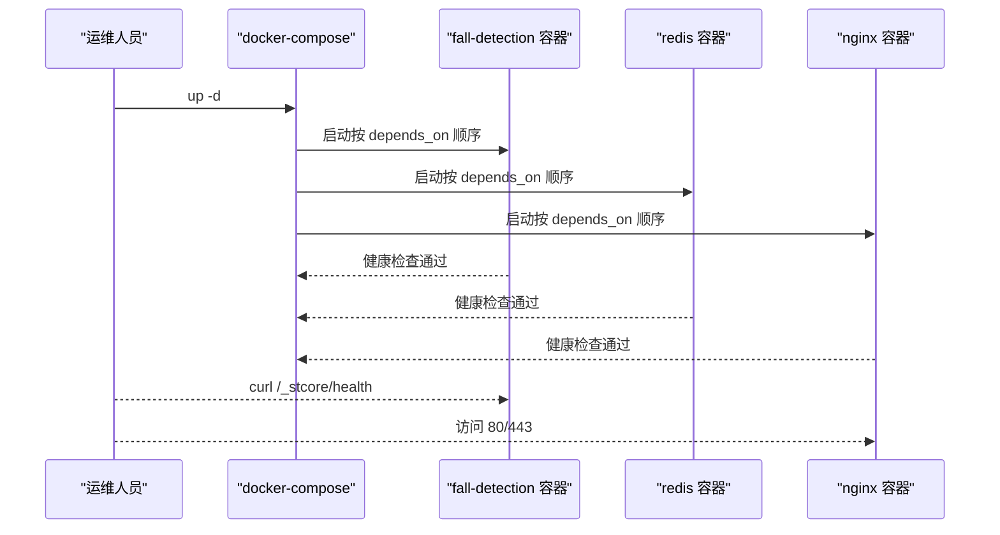
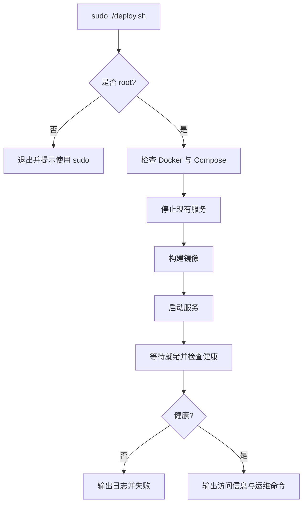
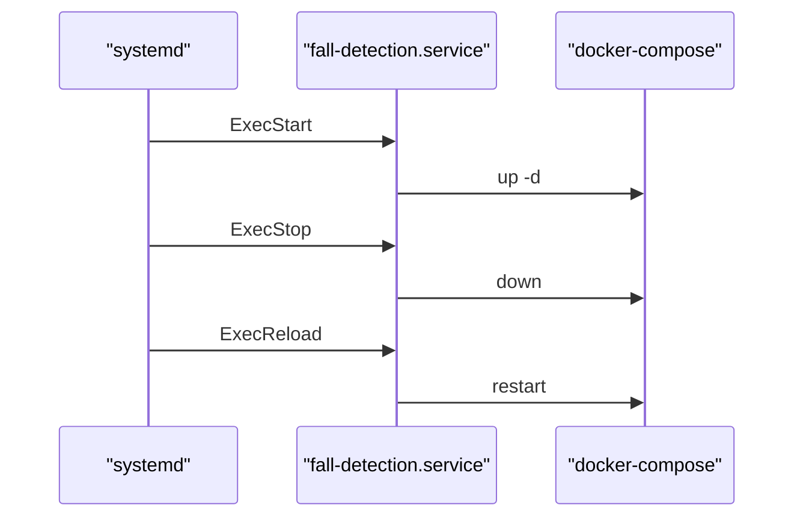
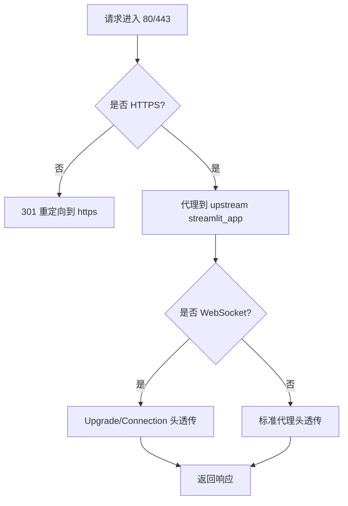
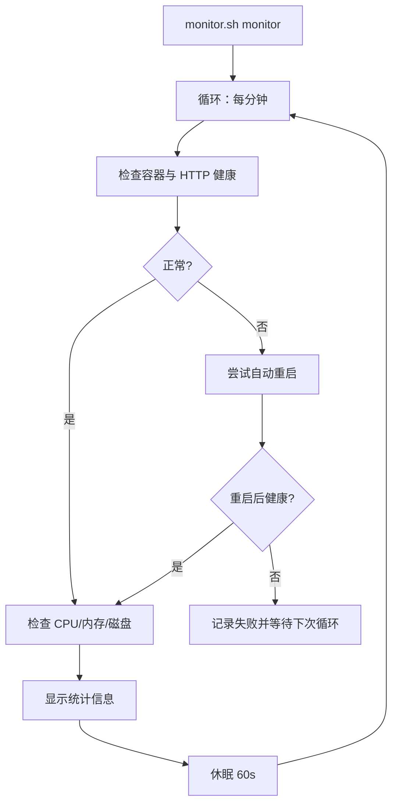
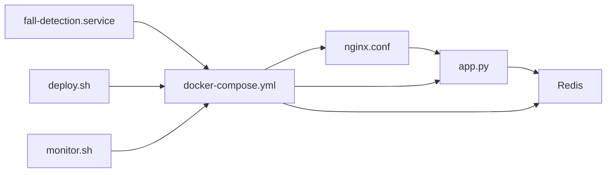

# 部署与运维

<cite>
**本文引用的文件**
- [Dockerfile](file://Dockerfile)
- [docker-compose.yml](file://docker-compose.yml)
- [deploy.sh](file://deploy.sh)
- [start.sh](file://start.sh)
- [fall-detection.service](file://fall-detection.service)
- [nginx.conf](file://nginx.conf)
- [monitor.sh](file://monitor.sh)
- [requirements.txt](file://requirements.txt)
- [app.py](file://app.py)
- [README.md](file://README.md)
- [docs/DEPLOYMENT_GUIDE.md](file://docs/DEPLOYMENT_GUIDE.md)
- [demos/fall_detection_demo.py](file://demos/fall_detection_demo.py)
</cite>

## 目录
1. [简介](#简介)
2. [项目结构](#项目结构)
3. [核心组件](#核心组件)
4. [架构总览](#架构总览)
5. [详细组件分析](#详细组件分析)
6. [依赖关系分析](#依赖关系分析)
7. [性能考量](#性能考量)
8. [故障排查指南](#故障排查指南)
9. [结论](#结论)
10. [附录](#附录)

## 简介
本文件面向生产环境的部署与运维，围绕 GuardianFall（摔倒检测系统）的容器化部署、systemd 服务管理、Nginx 反向代理、监控与日志、健康检查与故障恢复、升级与备份恢复、安全加固与容量规划等方面进行系统化说明。文档同时提供部署脚本解析、环境变量配置、性能监控指标与告警建议，并给出最佳实践与灾难恢复方案。

## 项目结构
GuardianFall 的部署与运维相关文件主要分布在根目录与 docs 子目录，核心包括：
- 容器化与编排：Dockerfile、docker-compose.yml
- 一键部署脚本：deploy.sh
- systemd 服务单元：fall-detection.service
- 反向代理：nginx.conf
- 监控脚本：monitor.sh
- 依赖清单：requirements.txt
- 应用入口：app.py
- 示例与演示：demos/fall_detection_demo.py
- 文档：README.md、docs/DEPLOYMENT_GUIDE.md

**图表来源**
- [Dockerfile:1-50](file://Dockerfile#L1-L50)
- [docker-compose.yml:1-149](file://docker-compose.yml#L1-L149)
- [deploy.sh:1-243](file://deploy.sh#L1-L243)
- [start.sh:1-109](file://start.sh#L1-L109)
- [fall-detection.service:1-28](file://fall-detection.service#L1-L28)
- [nginx.conf:1-127](file://nginx.conf#L1-L127)
- [monitor.sh:1-183](file://monitor.sh#L1-L183)
- [requirements.txt:1-34](file://requirements.txt#L1-L34)
- [app.py:1-662](file://app.py#L1-L662)
- [demos/fall_detection_demo.py:1-373](file://demos/fall_detection_demo.py#L1-L373)

**章节来源**
- [README.md:1-347](file://README.md#L1-L347)
- [docs/DEPLOYMENT_GUIDE.md:1-540](file://docs/DEPLOYMENT_GUIDE.md#L1-L540)

## 核心组件
- 容器镜像与健康检查：通过 Dockerfile 定义基础镜像、环境变量、系统依赖、端口暴露与健康检查；docker-compose.yml 提供服务编排、资源限制、日志轮转与网络隔离。
- 一键部署脚本：deploy.sh 提供安装 Docker/Docker Compose、停止现有服务、构建镜像、启动服务、状态检查与访问提示。
- systemd 服务：fall-detection.service 将 Docker Compose 作为系统服务管理，支持启动、停止、重启与超时控制。
- 反向代理：nginx.conf 提供 HTTP/HTTPS 代理、WebSocket 支持、安全头、Gzip 压缩、静态资源缓存与健康检查端点。
- 监控与日志：monitor.sh 提供服务状态检查、资源使用监控、日志查看、统计信息展示与自动重启能力。
- 应用与依赖：app.py 为 Streamlit Web UI 入口；requirements.txt 定义 Python 依赖；demos/fall_detection_demo.py 提供离线演示与录制能力。

**章节来源**
- [Dockerfile:1-50](file://Dockerfile#L1-L50)
- [docker-compose.yml:1-149](file://docker-compose.yml#L1-L149)
- [deploy.sh:1-243](file://deploy.sh#L1-L243)
- [fall-detection.service:1-28](file://fall-detection.service#L1-L28)
- [nginx.conf:1-127](file://nginx.conf#L1-L127)
- [monitor.sh:1-183](file://monitor.sh#L1-L183)
- [requirements.txt:1-34](file://requirements.txt#L1-L34)
- [app.py:1-662](file://app.py#L1-L662)
- [demos/fall_detection_demo.py:1-373](file://demos/fall_detection_demo.py#L1-L373)

## 架构总览
下图展示了生产环境的典型部署拓扑：前端通过 Nginx 反向代理访问 Streamlit 应用，Redis 作为会话缓存，三者运行在同一 Docker 网络中，容器具备健康检查与日志轮转。

**图表来源**
- [docker-compose.yml:6-149](file://docker-compose.yml#L6-L149)
- [nginx.conf:32-119](file://nginx.conf#L32-L119)
- [Dockerfile:44-46](file://Dockerfile#L44-L46)

## 详细组件分析

### Docker 容器化与健康检查
- 基础镜像与工作目录：基于精简 Python 基础镜像，设置工作目录与环境变量（如 Streamlit 端口、地址、headless 模式）。
- 系统依赖：安装图形与多媒体相关库、ffmpeg、USB 设备开发包等，满足 Open3D/视频处理需求。
- 依赖安装：pip 安装 requirements.txt；复制应用代码与创建持久化目录（datasets/logs/configs）。
- 端口与健康检查：暴露 8501；通过 curl 对 Streamlit 内部健康端点进行探测，失败即判定容器不健康。
- 启动命令：以 Streamlit 运行 app.py，绑定 0.0.0.0、8501、headless 模式。

**图表来源**
- [Dockerfile:1-50](file://Dockerfile#L1-L50)

**章节来源**
- [Dockerfile:1-50](file://Dockerfile#L1-L50)

### Docker Compose 编排与资源治理
- 服务编排：fall-detection 主应用、Redis 缓存、Nginx 反向代理（可选）。
- 环境变量：统一设置 Streamlit 端口、地址、headless、日志级别与检测阈值。
- 数据卷：挂载应用代码（开发热更新）、数据集、日志、配置目录。
- 资源限制：为主应用设置 CPU/内存上限与预留，Redis 限制较小资源。
- 健康检查：对 Streamlit 与 Redis 分别进行健康探测。
- 日志配置：json-file 驱动，单文件最大 10MB，最多 3 个文件。
- 网络隔离：自定义 bridge 网络，Nginx 依赖主应用，确保启动顺序。

**图表来源**
- [docker-compose.yml:6-149](file://docker-compose.yml#L6-L149)

**章节来源**
- [docker-compose.yml:1-149](file://docker-compose.yml#L1-L149)

### 一键部署脚本解析（deploy.sh）
- 权限与前置检查：要求 root 权限；自动安装 Docker 与 Docker Compose（若缺失）。
- 生命周期管理：停止现有服务、构建镜像、启动服务、等待就绪、状态检查与访问提示。
- 命令子集：支持 deploy、update、start、stop、logs、status、cleanup、help。
- 健康检查：通过 curl 访问本地 8501 端口，超时则输出日志并返回错误。
- 访问信息：输出本地与远程访问地址，以及常用运维命令。

**图表来源**
- [deploy.sh:1-243](file://deploy.sh#L1-L243)

**章节来源**
- [deploy.sh:1-243](file://deploy.sh#L1-L243)

### systemd 服务管理（fall-detection.service）
- 单次执行类型：oneshot，随工作目录切换执行 docker-compose up/down/restart。
- 依赖关系：After/network-online.target、Wants/network-online.target、Requires=docker.service。
- 超时控制：启动超时 300s，停止 30s。
- 工作目录：指向项目根目录，便于相对路径引用。

**图表来源**
- [fall-detection.service:1-28](file://fall-detection.service#L1-L28)

**章节来源**
- [fall-detection.service:1-28](file://fall-detection.service#L1-L28)

### Nginx 反向代理配置（nginx.conf）
- 基础与压缩：开启 gzip、keepalive、日志格式与访问/错误日志。
- 上游与代理：upstream 指向 fall-detection:8501；代理头设置、WebSocket 支持、超时与缓冲配置。
- HTTP->HTTPS：80 端口重定向至 443。
- HTTPS 与安全：TLSv1.2/1.3、现代加密套件、Strict-Transport-Security、X-Frame-Options、X-Content-Type-Options、Referrer-Policy 等。
- 静态资源缓存：图片、字体、CSS/JS 等 1 年缓存。
- 健康检查端点：/health 返回 200 healthy。
- SSL 证书：指向 /etc/nginx/ssl 下的证书文件。

**图表来源**
- [nginx.conf:32-119](file://nginx.conf#L32-L119)

**章节来源**
- [nginx.conf:1-127](file://nginx.conf#L1-L127)

### 监控与日志（monitor.sh）
- 服务状态：检查容器是否 Up、HTTP 200 响应。
- 资源使用：CPU、内存、磁盘使用率阈值检查。
- 日志查看：支持查看指定容器日志。
- 统计信息：启动时间、重启次数、网络统计、进程信息。
- 自动重启：当服务异常时尝试重启并验证。
- 监控循环：每分钟检查一次，持续运行。

**图表来源**
- [monitor.sh:128-146](file://monitor.sh#L128-L146)

**章节来源**
- [monitor.sh:1-183](file://monitor.sh#L1-L183)

### 环境变量与配置要点
- Dockerfile 环境变量：STREAMLIT_SERVER_PORT、STREAMLIT_SERVER_ADDRESS、STREAMLIT_SERVER_HEADLESS 等。
- docker-compose 环境变量：LOG_LEVEL、DETECTION_* 系列阈值参数。
- 应用侧配置：Streamlit 页面布局、headless、侧边栏控制面板、参数调节与配置持久化。

**章节来源**
- [Dockerfile:9-15](file://Dockerfile#L9-L15)
- [docker-compose.yml:19-28](file://docker-compose.yml#L19-L28)
- [app.py:94-101](file://app.py#L94-L101)

### 服务启动顺序与健康检查
- 启动顺序：Nginx 依赖 fall-detection，Redis 与应用并行启动但 fall-detection 依赖 Redis。
- 健康检查：容器层面通过 curl 探测 Streamlit 内部健康端点；Nginx 通过 /health 端点。
- 超时与重试：Compose 与 Dockerfile 健康检查均配置了间隔、超时与重试次数。

**章节来源**
- [docker-compose.yml:70-73](file://docker-compose.yml#L70-L73)
- [Dockerfile:44-46](file://Dockerfile#L44-L46)
- [nginx.conf:107-112](file://nginx.conf#L107-L112)

### 升级策略与备份恢复
- 升级：通过 deploy.sh update 拉取最新镜像并重建；或手动 docker-compose pull/build/up。
- 备份：备份 datasets、configs、logs 目录；恢复时停止服务后解压覆盖。
- 灾难恢复：重置 Docker 系统（清理容器、镜像、卷），重新 up -d。

**章节来源**
- [docs/DEPLOYMENT_GUIDE.md:454-483](file://docs/DEPLOYMENT_GUIDE.md#L454-L483)
- [docs/DEPLOYMENT_GUIDE.md:418-450](file://docs/DEPLOYMENT_GUIDE.md#L418-L450)
- [docs/DEPLOYMENT_GUIDE.md:399-414](file://docs/DEPLOYMENT_GUIDE.md#L399-L414)

## 依赖关系分析
- 组件耦合：Nginx 依赖 Streamlit；Streamlit 依赖 Redis；三者位于同一 bridge 网络。
- 外部依赖：Docker、Docker Compose、systemd、nginx、Redis、Streamlit、Open3D、OpenCV、PyTorch 等。
- 潜在环依赖：compose 文件中通过 depends_on 控制启动顺序，未见直接环依赖。

**图表来源**
- [docker-compose.yml:6-149](file://docker-compose.yml#L6-L149)
- [nginx.conf:32-119](file://nginx.conf#L32-L119)
- [app.py:1-662](file://app.py#L1-L662)
- [fall-detection.service:1-28](file://fall-detection.service#L1-L28)
- [deploy.sh:1-243](file://deploy.sh#L1-L243)
- [monitor.sh:1-183](file://monitor.sh#L1-L183)

**章节来源**
- [docker-compose.yml:1-149](file://docker-compose.yml#L1-L149)

## 性能考量
- 资源限制：主应用设置 CPU/内存上限与预留；Redis 限制较小资源，避免抢占。
- 端口与网络：Streamlit 仅在容器内部监听，通过 Nginx 暴露；Nginx 优化 keepalive、gzip、静态资源缓存。
- 健康检查：合理设置间隔、超时与重试，避免误判。
- 日志轮转：json-file 驱动，单文件大小与数量限制，防止磁盘膨胀。
- 建议：使用 SSD、增加内存与 CPU 核心、定期清理旧日志与数据集。

**章节来源**
- [docker-compose.yml:41-64](file://docker-compose.yml#L41-L64)
- [nginx.conf:24-30](file://nginx.conf#L24-L30)
- [docs/DEPLOYMENT_GUIDE.md:519-525](file://docs/DEPLOYMENT_GUIDE.md#L519-L525)

## 故障排查指南
- 服务无法启动：检查 Docker 状态、端口占用、内存与依赖；查看容器日志。
- 无法访问 Web 界面：检查防火墙、端口监听、健康检查；确认 Nginx 配置与证书。
- 性能低下：降低体素尺寸、帧率；增加资源；使用 SSD。
- 频繁崩溃：查看崩溃日志、增加 Swap；检查内存与磁盘。
- Docker 相关：停止所有容器、删除镜像、清理系统后重新构建。

**章节来源**
- [docs/DEPLOYMENT_GUIDE.md:329-414](file://docs/DEPLOYMENT_GUIDE.md#L329-L414)

## 结论
通过 Docker 容器化与 Compose 编排、systemd 服务管理、Nginx 反向代理与健康检查，GuardianFall 系统实现了可重复、可观测、可恢复的生产级部署。结合监控脚本与完善的升级、备份与灾难恢复流程，可有效保障系统稳定性与可用性。建议在生产环境中配合防火墙、HTTPS、日志轮转与定期巡检，持续优化资源配置与安全策略。

## 附录

### 环境变量与参数参考
- Dockerfile 环境变量：STREAMLIT_SERVER_PORT、STREAMLIT_SERVER_ADDRESS、STREAMLIT_SERVER_HEADLESS 等。
- docker-compose 环境变量：LOG_LEVEL、DETECTION_HEIGHT_THRESHOLD、DETECTION_VELOCITY_THRESHOLD、DETECTION_CONFIRMATION_FRAMES 等。
- 应用侧配置：体素尺寸、高度骤降阈值、速度阈值、确认帧数、帧率等。

**章节来源**
- [Dockerfile:9-15](file://Dockerfile#L9-L15)
- [docker-compose.yml:19-28](file://docker-compose.yml#L19-L28)
- [app.py:94-101](file://app.py#L94-L101)

### 健康检查与故障恢复
- 容器健康检查：Dockerfile 与 Compose 均配置健康检查，失败时自动重启策略生效。
- 故障恢复：monitor.sh 提供自动重启与状态检查；deploy.sh 提供一键部署与状态检查。

**章节来源**
- [Dockerfile:44-46](file://Dockerfile#L44-L46)
- [docker-compose.yml:51-57](file://docker-compose.yml#L51-L57)
- [monitor.sh:112-125](file://monitor.sh#L112-L125)
- [deploy.sh:84-102](file://deploy.sh#L84-L102)

### 安全加固与最佳实践
- 防火墙：仅开放必要端口（22、80、443、8501）。
- HTTPS：使用 Let's Encrypt 证书，自动续期。
- 访问控制：IP 白名单或 VPN。
- 监控与审计：定期检查日志与异常访问。
- 资源与存储：使用 SSD、定期清理日志与数据集。

**章节来源**
- [docs/DEPLOYMENT_GUIDE.md:509-533](file://docs/DEPLOYMENT_GUIDE.md#L509-L533)

### 容量规划与运维建议
- 硬件建议：内存 4GB+、CPU 2 核+、SSD 存储。
- 运维建议：设置监控与告警、定期备份、文档记录、测试演练。

**章节来源**
- [docs/DEPLOYMENT_GUIDE.md:519-533](file://docs/DEPLOYMENT_GUIDE.md#L519-L533)