# 部署与运维

<cite>
**本文引用的文件**
- [Dockerfile](file://Dockerfile)
- [Dockerfile.api](file://Dockerfile.api)
- [docker-compose.yml](file://docker-compose.yml)
- [deploy.sh](file://deploy.sh)
- [start.sh](file://start.sh)
- [fall-detection.service](file://fall-detection.service)
- [nginx.conf](file://nginx.conf)
- [monitor.sh](file://monitor.sh)
- [requirements.txt](file://requirements.txt)
- [app.py](file://app.py)
- [src/api/main.py](file://src/api/main.py)
- [src/api/detection_service.py](file://src/api/detection_service.py)
- [src/api/models.py](file://src/api/models.py)
- [config.yaml](file://config.yaml)
- [README.md](file://README.md)
- [docs/DEPLOYMENT_GUIDE.md](file://docs/DEPLOYMENT_GUIDE.md)
- [demos/fall_detection_demo.py](file://demos/fall_detection_demo.py)
- [start-web.sh](file://start-web.sh)
</cite>

## 更新摘要
**变更内容**
- 新增Docker API服务容器，实现Web界面与检测逻辑的微服务分离
- 更新Docker Compose编排配置，支持多服务架构
- 增强容器间通信与依赖管理
- 更新健康检查与监控策略
- 优化服务启动顺序与资源分配
- 新增systemd服务管理配置
- 新增Nginx反向代理配置
- 新增监控脚本和部署脚本

## 目录
1. [简介](#简介)
2. [项目结构](#项目结构)
3. [核心组件](#核心组件)
4. [架构总览](#架构总览)
5. [详细组件分析](#详细组件分析)
6. [依赖关系分析](#依赖关系分析)
7. [性能考量](#性能考量)
8. [故障排查指南](#故障排查指南)
9. [结论](#结论)
10. [附录](#附录)

## 简介
本文件面向生产环境的部署与运维，围绕 GuardianFall（摔倒检测系统）的微服务架构容器化部署、systemd 服务管理、Nginx 反向代理、监控与日志、健康检查与故障恢复、升级与备份恢复、安全加固与容量规划等方面进行系统化说明。文档同时提供部署脚本解析、环境变量配置、性能监控指标与告警建议，并给出最佳实践与灾难恢复方案。

**更新** 系统现已从单体应用架构转变为微服务架构，包含Web界面服务、API服务和Redis缓存服务，提供更好的可扩展性和维护性。新增了完整的容器化部署配置、Docker Compose编排、systemd服务管理、Nginx反向代理配置，以及专业的监控工具。

## 项目结构
GuardianFall 的微服务架构部署与运维相关文件主要分布在根目录与 docs 子目录，核心包括：
- 容器化与编排：Dockerfile（Web界面）、Dockerfile.api（API服务）、docker-compose.yml
- 一键部署脚本：deploy.sh
- systemd 服务单元：fall-detection.service
- 反向代理：nginx.conf
- 监控脚本：monitor.sh
- 依赖清单：requirements.txt
- 应用入口：app.py、src/api/main.py
- API服务：src/api/detection_service.py、src/api/models.py
- 配置文件：config.yaml
- 示例与演示：demos/fall_detection_demo.py
- 文档：README.md、docs/DEPLOYMENT_GUIDE.md

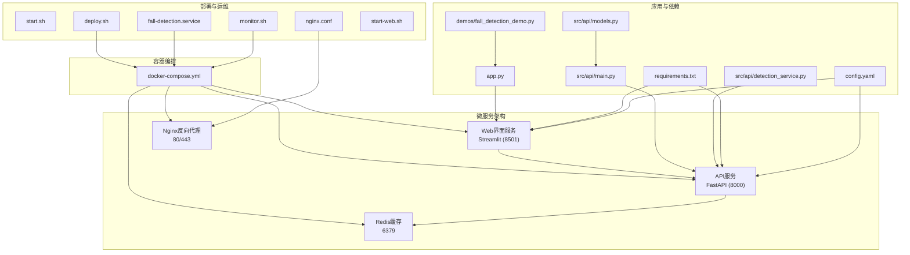

**图表来源**
- [docker-compose.yml:6-209](file://docker-compose.yml#L6-L209)
- [Dockerfile:1-50](file://Dockerfile#L1-L50)
- [Dockerfile.api:1-50](file://Dockerfile.api#L1-L50)
- [src/api/main.py:1-265](file://src/api/main.py#L1-L265)
- [src/api/detection_service.py:1-285](file://src/api/detection_service.py#L1-L285)
- [src/api/models.py:1-183](file://src/api/models.py#L1-L183)

**章节来源**
- [README.md:1-347](file://README.md#L1-L347)
- [docs/DEPLOYMENT_GUIDE.md:1-540](file://docs/DEPLOYMENT_GUIDE.md#L1-L540)

## 核心组件
- **微服务架构**：Web界面服务（Streamlit）与API服务（FastAPI）分离，通过RESTful API通信，Redis提供缓存支持，Nginx提供反向代理。
- **容器镜像与健康检查**：Web服务基于Dockerfile，API服务基于Dockerfile.api，分别定义基础镜像、环境变量、系统依赖、端口暴露与健康检查；docker-compose.yml 提供服务编排、资源限制、日志轮转与网络隔离。
- **一键部署脚本**：deploy.sh 提供安装 Docker/Docker Compose、停止现有服务、构建镜像、启动服务、状态检查与访问提示。
- **systemd 服务**：fall-detection.service 将 Docker Compose 作为系统服务管理，支持启动、停止、重启与超时控制。
- **反向代理**：nginx.conf 提供 HTTP/HTTPS 代理、WebSocket 支持、安全头、Gzip 压缩、静态资源缓存与健康检查端点。
- **监控与日志**：monitor.sh 提供服务状态检查、资源使用监控、日志查看、统计信息展示与自动重启能力。
- **应用与依赖**：app.py 为 Streamlit Web UI 入口；src/api/main.py 为 FastAPI RESTful API 入口；requirements.txt 定义 Python 依赖；src/api/detection_service.py 提供检测服务逻辑；src/api/models.py 定义API数据模型。

**章节来源**
- [docker-compose.yml:6-209](file://docker-compose.yml#L6-L209)
- [Dockerfile:1-50](file://Dockerfile#L1-L50)
- [Dockerfile.api:1-50](file://Dockerfile.api#L1-L50)
- [src/api/main.py:1-265](file://src/api/main.py#L1-L265)
- [src/api/detection_service.py:1-285](file://src/api/detection_service.py#L1-L285)
- [src/api/models.py:1-183](file://src/api/models.py#L1-L183)

## 架构总览
下图展示了微服务架构的典型部署拓扑：Web界面通过Nginx反向代理访问API服务，API服务调用检测服务处理数据，Redis提供缓存支持，三者运行在同一Docker网络中，容器具备独立的健康检查与日志轮转。

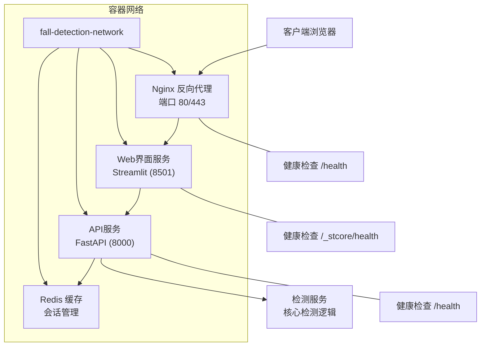

**图表来源**
- [docker-compose.yml:6-209](file://docker-compose.yml#L6-L209)
- [nginx.conf:78-112](file://nginx.conf#L78-L112)
- [src/api/main.py:108-121](file://src/api/main.py#L108-L121)

## 详细组件分析

### 微服务架构设计
- **服务分离**：Web界面服务专注于用户交互和可视化，API服务专注于业务逻辑和数据处理，实现职责分离。
- **API设计**：采用RESTful API规范，提供完整的检测控制、状态查询、数据获取和配置管理接口。
- **异步处理**：检测服务使用asyncio实现非阻塞处理，支持WebSocket实时数据推送。
- **配置管理**：通过config.yaml集中管理各服务配置，支持运行时动态调整。

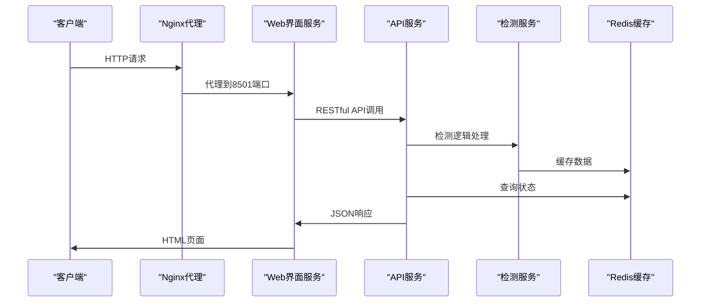

**图表来源**
- [docker-compose.yml:74-133](file://docker-compose.yml#L74-L133)
- [src/api/main.py:131-155](file://src/api/main.py#L131-L155)

**章节来源**
- [docker-compose.yml:6-209](file://docker-compose.yml#L6-L209)
- [src/api/main.py:1-265](file://src/api/main.py#L1-L265)

### Docker API服务容器化
- **基础镜像与工作目录**：基于python:3.10-slim，设置工作目录与环境变量（LOG_LEVEL、PYTHONUNBUFFERED等）。
- **系统依赖**：安装OpenGL库、cmake、pkg-config、USB设备开发包、ffmpeg等，满足Open3D/视频处理需求。
- **依赖安装**：pip 安装 requirements.txt；复制API源码与配置文件。
- **端口与健康检查**：暴露 8000；通过 curl 对 /health 端点进行探测，失败即判定容器不健康。
- **启动命令**：使用uvicorn运行FastAPI应用，配置1个工作进程。

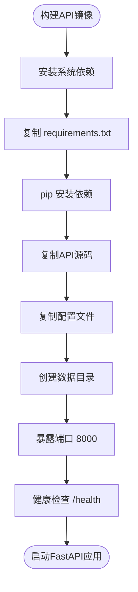

**图表来源**
- [Dockerfile.api:1-50](file://Dockerfile.api#L1-L50)

**章节来源**
- [Dockerfile.api:1-50](file://Dockerfile.api#L1-L50)

### Docker Compose 微服务编排与资源治理
- **服务编排**：web-ui（Web界面）、api（API服务）、redis（缓存）、nginx（反向代理）四服务架构。
- **环境变量**：统一设置LOG_LEVEL、API_BASE_URL、DETECTION_*系列阈值参数。
- **数据卷**：挂载应用代码（开发热更新）、数据集、日志、配置目录。
- **资源限制**：Web服务限制1CPU/1G内存，API服务限制2CPU/2G内存，Redis限制0.5CPU/256M内存。
- **健康检查**：对Web、API、Redis分别进行健康探测。
- **日志配置**：json-file驱动，单文件最大10MB，最多3个文件。
- **网络隔离**：自定义bridge网络，服务间通过服务名通信。

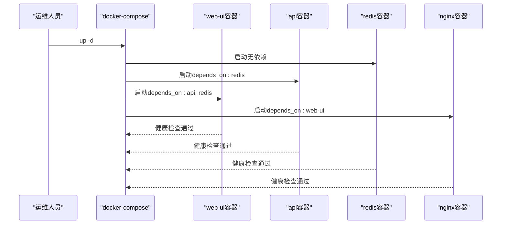

**图表来源**
- [docker-compose.yml:6-209](file://docker-compose.yml#L6-L209)

**章节来源**
- [docker-compose.yml:1-209](file://docker-compose.yml#L1-L209)

### FastAPI 检测服务
- **RESTful API**：提供完整的检测控制接口，包括启动/停止检测、状态查询、数据获取、配置管理等。
- **WebSocket支持**：实现实时状态推送，每秒推送一次系统状态。
- **数据模型**：使用Pydantic定义请求和响应模型，确保数据一致性。
- **异步处理**：检测服务使用asyncio实现非阻塞处理，支持并发请求。
- **错误处理**：统一的异常处理机制，返回标准化的错误响应。

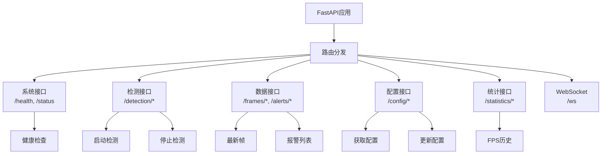

**图表来源**
- [src/api/main.py:97-265](file://src/api/main.py#L97-L265)
- [src/api/models.py:28-183](file://src/api/models.py#L28-L183)

**章节来源**
- [src/api/main.py:1-265](file://src/api/main.py#L1-L265)
- [src/api/detection_service.py:1-285](file://src/api/detection_service.py#L1-L285)
- [src/api/models.py:1-183](file://src/api/models.py#L1-L183)

### 一键部署脚本解析（deploy.sh）
- **权限与前置检查**：要求 root 权限；自动安装 Docker 与 Docker Compose（若缺失）。
- **生命周期管理**：停止现有服务、构建镜像、启动服务、等待就绪、状态检查与访问提示。
- **命令子集**：支持 deploy、update、start、stop、logs、status、cleanup、help。
- **健康检查**：通过 curl 访问本地 8501 端口，超时则输出日志并返回错误。
- **访问信息**：输出本地与远程访问地址，以及常用运维命令。

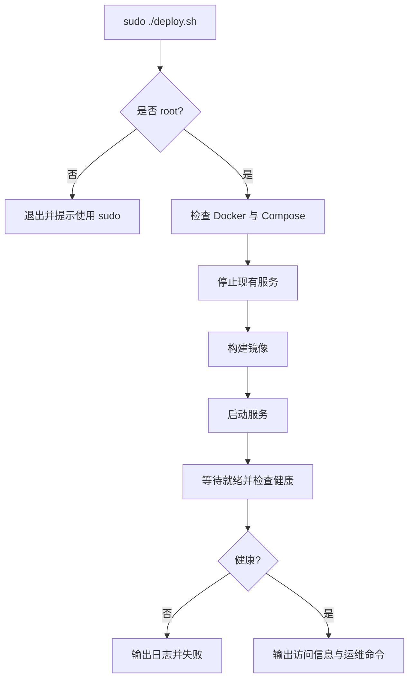

**图表来源**
- [deploy.sh:1-243](file://deploy.sh#L1-L243)

**章节来源**
- [deploy.sh:1-243](file://deploy.sh#L1-L243)

### systemd 服务管理（fall-detection.service）
- **单次执行类型**：oneshot，随工作目录切换执行 docker-compose up/down/restart。
- **依赖关系**：After/network-online.target、Wants/network-online.target、Requires=docker.service。
- **超时控制**：启动超时 300s，停止 30s。
- **工作目录**：指向项目根目录，便于相对路径引用。

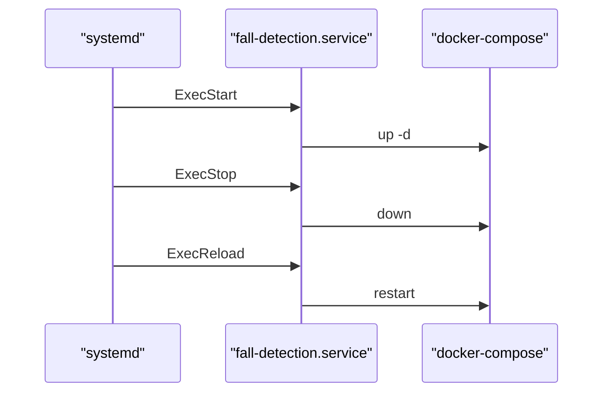

**图表来源**
- [fall-detection.service:1-28](file://fall-detection.service#L1-L28)

**章节来源**
- [fall-detection.service:1-28](file://fall-detection.service#L1-L28)

### Nginx 反向代理配置（nginx.conf）
- **基础与压缩**：开启 gzip、keepalive、日志格式与访问/错误日志。
- **上游与代理**：upstream 指向 web-ui:8501；代理头设置、WebSocket 支持、超时与缓冲配置。
- **HTTP->HTTPS**：80 端口重定向至 443。
- **HTTPS 与安全**：TLSv1.2/1.3、现代加密套件、Strict-Transport-Security、X-Frame-Options、X-Content-Type-Options、Referrer-Policy 等。
- **静态资源缓存**：图片、字体、CSS/JS 等 1 年缓存。
- **健康检查端点**：/health 返回 200 healthy。
- **SSL 证书**：指向 /etc/nginx/ssl 下的证书文件。

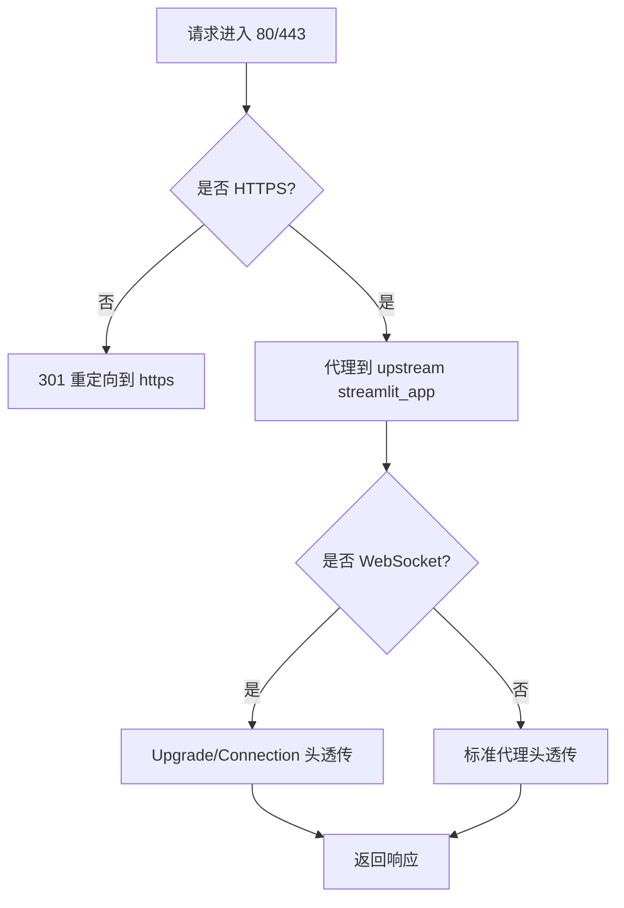

**图表来源**
- [nginx.conf:78-112](file://nginx.conf#L78-L112)

**章节来源**
- [nginx.conf:1-127](file://nginx.conf#L1-L127)

### 监控与日志（monitor.sh）
- **服务状态**：检查容器是否 Up、HTTP 200 响应。
- **资源使用**：CPU、内存、磁盘使用率阈值检查。
- **日志查看**：支持查看指定容器日志。
- **统计信息**：启动时间、重启次数、网络统计、进程信息。
- **自动重启**：当服务异常时尝试重启并验证。
- **监控循环**：每分钟检查一次，持续运行。

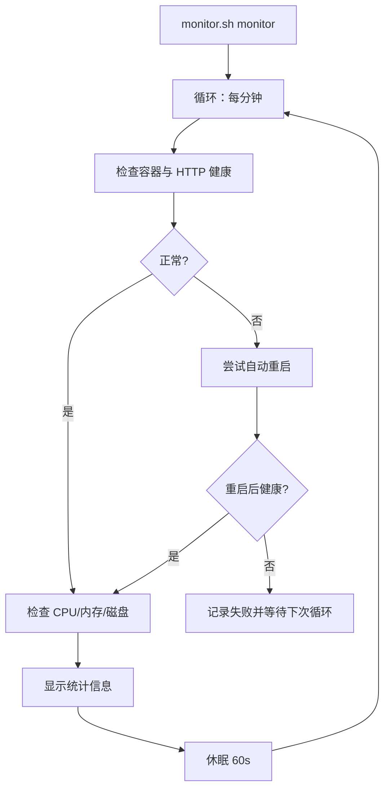

**图表来源**
- [monitor.sh:128-146](file://monitor.sh#L128-L146)

**章节来源**
- [monitor.sh:1-183](file://monitor.sh#L1-L183)

### 环境变量与配置要点
- **Dockerfile 环境变量**：STREAMLIT_SERVER_PORT、STREAMLIT_SERVER_ADDRESS、STREAMLIT_SERVER_HEADLESS 等。
- **Dockerfile.api 环境变量**：LOG_LEVEL、DETECTION_HEIGHT_THRESHOLD、DETECTION_VELOCITY_THRESHOLD、DETECTION_CONFIRMATION_FRAMES 等。
- **docker-compose 环境变量**：API_BASE_URL、REDIS_URL、LOG_LEVEL 等。
- **应用侧配置**：Streamlit 页面布局、headless、侧边栏控制面板、参数调节与配置持久化。

**章节来源**
- [Dockerfile:9-15](file://Dockerfile#L9-L15)
- [Dockerfile.api:9-13](file://Dockerfile.api#L9-L13)
- [docker-compose.yml:19-91](file://docker-compose.yml#L19-L91)
- [app.py:94-101](file://app.py#L94-L101)

### 服务启动顺序与健康检查
- **启动顺序**：Redis优先启动，API依赖Redis，Web依赖API和Redis，Nginx依赖Web。
- **健康检查**：容器层面通过 curl 探测 /health 或 /_stcore/health 端点；Nginx通过 /health 端点。
- **超时与重试**：Compose 与 Dockerfile 健康检查均配置了间隔、超时与重试次数。

**章节来源**
- [docker-compose.yml:69-132](file://docker-compose.yml#L69-L132)
- [Dockerfile:44-46](file://Dockerfile#L44-L46)
- [Dockerfile.api:44-46](file://Dockerfile.api#L44-L46)
- [nginx.conf:107-112](file://nginx.conf#L107-L112)

### 升级策略与备份恢复
- **升级**：通过 deploy.sh update 拉取最新镜像并重建；或手动 docker-compose pull/build/up。
- **备份**：备份 datasets、data、logs 目录；恢复时停止服务后解压覆盖。
- **灾难恢复**：重置 Docker 系统（清理容器、镜像、卷），重新 up -d。

**章节来源**
- [docs/DEPLOYMENT_GUIDE.md:454-483](file://docs/DEPLOYMENT_GUIDE.md#L454-L483)
- [docs/DEPLOYMENT_GUIDE.md:418-450](file://docs/DEPLOYMENT_GUIDE.md#L418-L450)
- [docs/DEPLOYMENT_GUIDE.md:399-414](file://docs/DEPLOYMENT_GUIDE.md#L399-L414)

### Web界面启动脚本（start-web.sh）
- **虚拟环境激活**：自动激活项目虚拟环境。
- **Streamlit启动**：启动Web界面服务，监听0.0.0.0:8501。
- **访问信息**：显示本地和远程访问地址。
- **工作目录**：固定指向/root/.openclaw/workspace/projects/fall-detection-system。

**章节来源**
- [start-web.sh:1-22](file://start-web.sh#L1-L22)

## 依赖关系分析
- **组件耦合**：Web服务依赖API服务；API服务依赖Redis；Nginx依赖Web；三者位于同一 bridge 网络。
- **外部依赖**：Docker、Docker Compose、systemd、nginx、Redis、Streamlit、FastAPI、Open3D、OpenCV、PyTorch 等。
- **微服务通信**：Web通过API_BASE_URL访问API服务，API通过REDIS_URL访问Redis缓存。

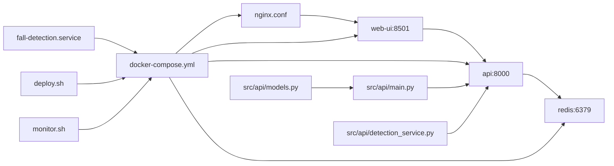

**图表来源**
- [docker-compose.yml:6-209](file://docker-compose.yml#L6-L209)
- [nginx.conf:78-112](file://nginx.conf#L78-L112)
- [src/api/main.py:20-24](file://src/api/main.py#L20-L24)

**章节来源**
- [docker-compose.yml:1-209](file://docker-compose.yml#L1-L209)

## 性能考量
- **资源限制**：Web服务设置1CPU/1G内存，API服务设置2CPU/2G内存，Redis设置0.5CPU/256M内存，避免资源争用。
- **端口与网络**：Web仅在容器内部监听8501，API监听8000，通过Nginx统一对外暴露；Nginx优化keepalive、gzip、静态资源缓存。
- **健康检查**：合理设置间隔、超时与重试，避免误判。
- **日志轮转**：json-file驱动，单文件大小与数量限制，防止磁盘膨胀。
- **建议**：使用SSD、增加内存与CPU核心、定期清理旧日志与数据集。

**章节来源**
- [docker-compose.yml:40-161](file://docker-compose.yml#L40-L161)
- [nginx.conf:24-30](file://nginx.conf#L24-L30)
- [docs/DEPLOYMENT_GUIDE.md:519-525](file://docs/DEPLOYMENT_GUIDE.md#L519-L525)

## 故障排查指南
- **服务无法启动**：检查Docker状态、端口占用、内存与依赖；查看容器日志。
- **无法访问Web界面**：检查防火墙、端口监听、健康检查；确认Nginx配置与证书。
- **API服务异常**：检查Redis连接、检测服务状态、配置文件；查看API日志。
- **性能低下**：降低体素尺寸、帧率；增加资源；使用SSD。
- **频繁崩溃**：查看崩溃日志、增加Swap；检查内存与磁盘。
- **Docker相关**：停止所有容器、删除镜像、清理系统后重新构建。

**章节来源**
- [docs/DEPLOYMENT_GUIDE.md:329-414](file://docs/DEPLOYMENT_GUIDE.md#L329-L414)

## 结论
通过微服务架构的Docker容器化与Compose编排、systemd 服务管理、Nginx 反向代理与健康检查，GuardianFall 系统实现了可重复、可观测、可恢复的生产级部署。Web界面与API服务的分离提供了更好的可扩展性和维护性，结合监控脚本与完善的升级、备份与灾难恢复流程，可有效保障系统稳定性与可用性。建议在生产环境中配合防火墙、HTTPS、日志轮转与定期巡检，持续优化资源配置与安全策略。

## 附录

### 环境变量与参数参考
- **Dockerfile 环境变量**：STREAMLIT_SERVER_PORT、STREAMLIT_SERVER_ADDRESS、STREAMLIT_SERVER_HEADLESS 等。
- **Dockerfile.api 环境变量**：LOG_LEVEL、DETECTION_HEIGHT_THRESHOLD、DETECTION_VELOCITY_THRESHOLD、DETECTION_CONFIRMATION_FRAMES 等。
- **docker-compose 环境变量**：API_BASE_URL、REDIS_URL、LOG_LEVEL 等。
- **应用侧配置**：体素尺寸、高度骤降阈值、速度阈值、确认帧数、帧率等。

**章节来源**
- [Dockerfile:9-15](file://Dockerfile#L9-L15)
- [Dockerfile.api:9-13](file://Dockerfile.api#L9-L13)
- [docker-compose.yml:19-91](file://docker-compose.yml#L19-L91)
- [app.py:94-101](file://app.py#L94-L101)

### 健康检查与故障恢复
- **容器健康检查**：Dockerfile与Dockerfile.api均配置健康检查，失败时自动重启策略生效。
- **故障恢复**：monitor.sh 提供自动重启与状态检查；deploy.sh 提供一键部署与状态检查。

**章节来源**
- [Dockerfile:44-46](file://Dockerfile#L44-L46)
- [Dockerfile.api:44-46](file://Dockerfile.api#L44-L46)
- [docker-compose.yml:50-153](file://docker-compose.yml#L50-L153)
- [monitor.sh:112-125](file://monitor.sh#L112-L125)
- [deploy.sh:84-102](file://deploy.sh#L84-L102)

### 安全加固与最佳实践
- **防火墙**：仅开放必要端口（22、80、443、8501、8000）。
- **HTTPS**：使用Let's Encrypt证书，自动续期。
- **访问控制**：IP白名单或VPN。
- **监控与审计**：定期检查日志与异常访问。
- **资源与存储**：使用SSD、定期清理日志与数据集。

**章节来源**
- [docs/DEPLOYMENT_GUIDE.md:509-533](file://docs/DEPLOYMENT_GUIDE.md#L509-L533)

### 容量规划与运维建议
- **硬件建议**：内存4GB+、CPU2核+、SSD存储。
- **运维建议**：设置监控与告警、定期备份、文档记录、测试演练。

**章节来源**
- [docs/DEPLOYMENT_GUIDE.md:519-533](file://docs/DEPLOYMENT_GUIDE.md#L519-L533)

### API接口参考
- **系统接口**：GET /health、GET /status
- **检测接口**：POST /detection/start、POST /detection/stop、GET /detection/status
- **数据接口**：GET /frames/latest、GET /frames/{frame_id}、GET /alerts、GET /alerts/stats、DELETE /alerts/clear
- **配置接口**：GET /config、PUT /config、POST /config/reset
- **统计接口**：GET /statistics、GET /statistics/fps/history
- **WebSocket**：/ws 实时状态推送

**章节来源**
- [src/api/main.py:97-265](file://src/api/main.py#L97-L265)
- [src/api/models.py:28-183](file://src/api/models.py#L28-L183)

### 部署脚本命令参考
- **完整部署**：`./deploy.sh deploy`
- **更新部署**：`./deploy.sh update`
- **仅启动**：`./deploy.sh start`
- **仅停止**：`./deploy.sh stop`
- **查看日志**：`./deploy.sh logs`
- **查看状态**：`./deploy.sh status`
- **清理资源**：`./deploy.sh cleanup`
- **监控服务**：`./monitor.sh monitor`
- **查看统计**：`./monitor.sh stats`
- **重启服务**：`./monitor.sh restart`

**章节来源**
- [deploy.sh:191-242](file://deploy.sh#L191-L242)
- [monitor.sh:149-182](file://monitor.sh#L149-L182)